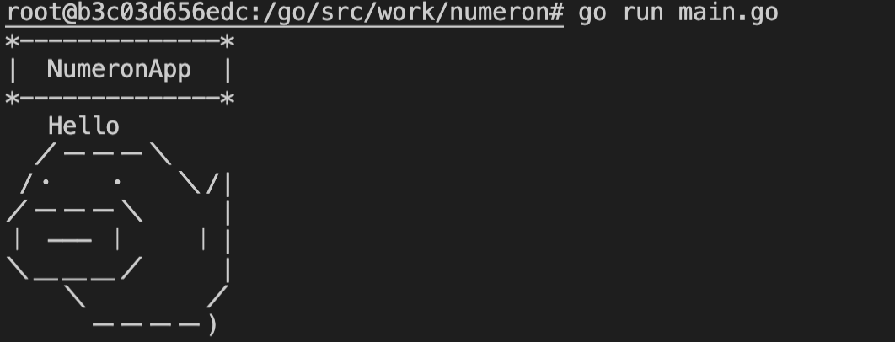
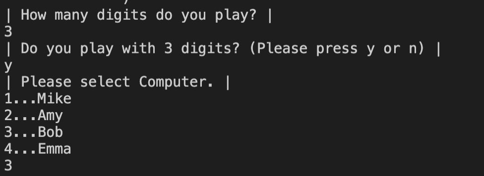
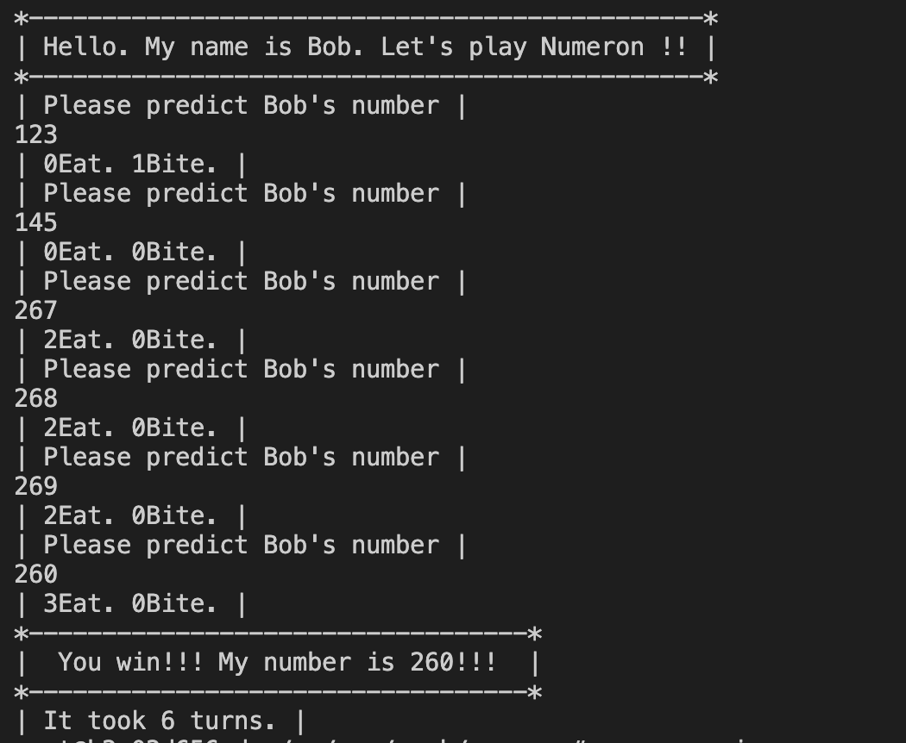

# ヌメロンアプリ(Goの練習)

## 環境
```go:env
- Docker 20.10.0
- go 1.15
```
<!--  - github.com/360EntSecGroup-Skylar/excelize/v2 v2.3.2 -->

### 参考
- [DockerでGoの開発環境を構築する](https://qiita.com/uji_/items/8c9eda89526abe0ba900)

- [Go言語の依存モジュール管理ツール Modules の使い方](https://qiita.com/uchiko/items/64fb3020dd64cf211d4e)

- [Go Modules でインターネット上のレポジトリにはないローカルパッケージを import する方法](https://qiita.com/hnishi/items/a9217249d7832ed2c035)


<!-- masterブランチ・・・computerとplayerの構造体を分けた
mainブランチ・・・computerとplayerの構造体を一緒にした→いったん完成。 -->

## 使い方
次のコードで、プログラムのコンパイルと実行ができる。
```go:go run
go run main.go
```
すると、以下のような画面が表示される。


そして以下の画像のように、何桁でプレイするかと対戦相手を入力して設定する。


設定が終わったら選んだ桁数と対戦相手でヌメロンを行うことができる。



TODO
- コンピュータ側からの予測のフェーズも作る
- 戦績保存の実装